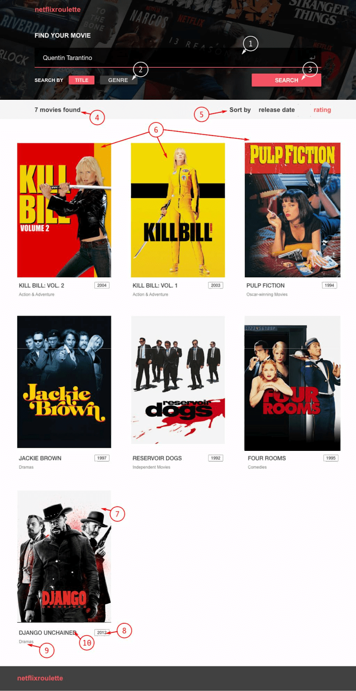

### Movies App <a href='https://druzhkova.github.io/MoviesApp/'>watch here</a>

### Create Movies App using React
---
Create a movie search app based on [free API](https://reactjs-cdp.herokuapp.com/api-docs)

UI proposed strategy: (choose your own if you want)

- basic form component should have an `input(1)`, `search by(2)` checkboxes and a `search(3)` button;

- results component should have a top-bar with results counter `found(4)` and `Sort by(5)` panel;

- results body should contain all found movies;

- a `movie(6)` component (should be only one and reusable) should have an `image(7)`, `release date(8)`, `genre(9)` and `title(10)` components;

- when user clicks on a movie, show a `Modal` component with full movie description:

---
- use redux to fetch your data, store it and pass to components;
- link app states between each other with React router. By default user lands on a new page with empty results state;
- when user clicks on a film item, redirect him to: 
localhost/film/id;
- handle invalid URLs: show a 404 page, where user will be redirected in case of invalid URL;
